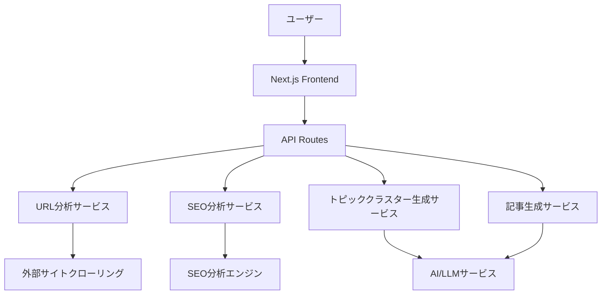

# 設計書

## 概要

記事作成支援サービスは、既存Webサイトを分析してSEOトピッククラスター戦略を提案し、高品質な記事を自動生成するWebアプリケーションです。Next.js 14（App Router）、TypeScript、Tailwind CSSを使用してモダンなフロントエンドを構築し、Vercelでデプロイします。

## アーキテクチャ

### システム構成



### 技術スタック

- **フロントエンド**: Next.js 14 (App Router), TypeScript, Tailwind CSS
- **バックエンド**: Next.js API Routes
- **AI/LLM**: OpenAI GPT-4 または Claude API
- **UI コンポーネント**: Radix UI + Tailwind CSS
- **状態管理**: React hooks (useState, useEffect)
- **デプロイ**: Vercel
- **パッケージマネージャー**: npm

## コンポーネントとインターフェース

### フロントエンドコンポーネント

#### 1. URLInputForm
- URL入力フィールド
- 自動URL取得ボタン
- 手動URL追加機能
- バリデーション機能

#### 2. SiteAnalysisDisplay
- 取得したURL一覧表示
- サイト概要表示
- 分析結果の可視化

#### 3. SEORecommendations
- SEO改善施策の表示
- 優先度別の施策リスト
- 実行可能なアクションアイテム

#### 4. TopicClusterVisualizer
- ツリー構造での可視化
- インタラクティブなノード操作
- 展開/折りたたみ機能

#### 5. ClusterExpansion
- クラスター追加フォーム
- 数量指定機能
- 進行状況表示

#### 6. ArticleGenerator
- クラスター選択チェックボックス
- 記事生成ボタン
- 生成進行状況表示
- 生成された記事の表示・ダウンロード

### APIエンドポイント

#### `/api/analyze-site`
- **メソッド**: POST
- **入力**: `{ url: string, additionalUrls?: string[] }`
- **出力**: `{ urls: string[], siteOverview: SiteOverview }`

#### `/api/seo-recommendations`
- **メソッド**: POST
- **入力**: `{ siteData: SiteOverview }`
- **出力**: `{ recommendations: SEORecommendation[] }`

#### `/api/generate-clusters`
- **メソッド**: POST
- **入力**: `{ siteData: SiteOverview }`
- **出力**: `{ clusters: TopicCluster[] }`

#### `/api/expand-clusters`
- **メソッド**: POST
- **入力**: `{ existingClusters: TopicCluster[], count: number }`
- **出力**: `{ newClusters: TopicCluster[] }`

#### `/api/generate-article`
- **メソッド**: POST
- **入力**: `{ selectedClusters: TopicCluster[] }`
- **出力**: `{ article: string, metadata: ArticleMetadata }`

## データモデル

### SiteOverview
```typescript
interface SiteOverview {
  domain: string;
  urls: string[];
  title: string;
  description: string;
  mainTopics: string[];
  contentStructure: ContentStructure;
  seoMetrics: SEOMetrics;
}
```

### TopicCluster
```typescript
interface TopicCluster {
  id: string;
  title: string;
  description: string;
  keywords: string[];
  pillarPage?: PillarPage;
  clusterPages: ClusterPage[];
  level: number;
  parentId?: string;
  children: TopicCluster[];
}
```

### ClusterPage
```typescript
interface ClusterPage {
  title: string;
  metaDescription: string;
  tags: string[];
  targetKeywords: string[];
  contentOutline: string[];
}
```

### SEORecommendation
```typescript
interface SEORecommendation {
  id: string;
  title: string;
  description: string;
  priority: 'high' | 'medium' | 'low';
  category: 'technical' | 'content' | 'structure';
  expectedImpact: string;
  actionItems: string[];
}
```

## エラーハンドリング

### フロントエンド
- ネットワークエラーの適切な表示
- バリデーションエラーのユーザーフレンドリーな表示
- ローディング状態の管理
- エラー境界（Error Boundary）の実装

### バックエンド
- API呼び出し失敗時のリトライ機能
- レート制限の実装
- 不正なURL入力への対応
- 外部サービス障害時のフォールバック

### エラーレスポンス形式
```typescript
interface ErrorResponse {
  error: string;
  message: string;
  code: number;
  details?: any;
}
```

## テスト戦略

### 単体テスト
- React コンポーネントのテスト（Jest + React Testing Library）
- API Routes のテスト
- ユーティリティ関数のテスト

### 統合テスト
- API エンドポイント間の連携テスト
- フロントエンドとバックエンドの統合テスト

### E2Eテスト
- 主要なユーザーフローのテスト
- クロスブラウザテスト

### テストカバレッジ
- 最低80%のコードカバレッジを目標
- 重要な機能は100%カバレッジを目指す

## セキュリティ考慮事項

### 入力検証
- URL形式の厳密な検証
- XSS攻撃の防止
- SQLインジェクション対策（該当する場合）

### API セキュリティ
- レート制限の実装
- CORS設定の適切な管理
- APIキーの安全な管理

### データ保護
- 個人情報の適切な取り扱い
- 一時的なデータの適切な削除
- HTTPS通信の強制

## パフォーマンス最適化

### フロントエンド
- コンポーネントの遅延読み込み
- 画像の最適化
- バンドルサイズの最小化
- キャッシュ戦略の実装

### バックエンド
- API レスポンスの最適化
- 並列処理の活用
- メモリ使用量の最適化
- 外部API呼び出しの効率化

## 監視とログ

### ログ記録
- API呼び出しのログ
- エラーログの詳細記録
- パフォーマンスメトリクスの記録

### 監視
- アプリケーションの稼働状況監視
- エラー率の監視
- レスポンス時間の監視